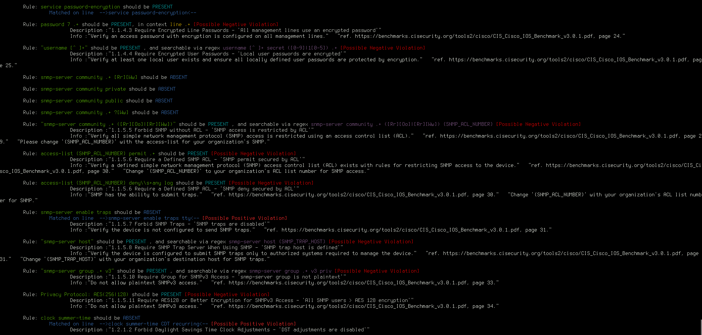
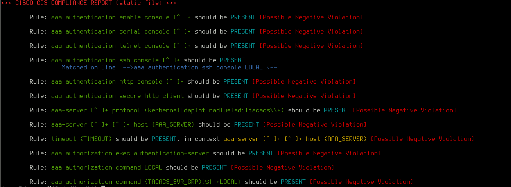

Running Nessus .audit vs. "show config" static file 
========================================

Description
------------
This utility parses simple rules from the nessus _.audit_ file  for Cisco IOS and Cisco Firewall and matches them up with
a static _"show run config"_ file. This utility was made out of need due to the fact that Nessus does not run policies 
against static config files, and requires a live system to audit.

The tool is not perfect but it makes the "first pass" attempts at pinpointing where to look further, with some guidance.

Example run with rule, and run with rules and guidance (-v):

* 

* 

The report is broken down by rules: matched, _positively_ violated,  _negatively_ violated or OK
The report is color-coded (ANSI) for ease of digestion. 

* How to read the output:

Example output:
_Rule: logging source-interface [Ll]oopback[0-9] should be PRESENT [Possible Negative Violation]_

Meaning  "logging source-interface [Ll]oopback[0-9]" rule is negatively violated where is not present and it should be

Example output:
_Rule: snmp-server enable traps should be ABSENT_
_Matched on line  -->snmp-server enable traps tty<-- [Possible Positive Violation]_

Meaning  "snmp-server enable traps" rule is positively violated where it should be absent and it should be absent

* The tool makes a reasonable pass at determining the context of the violation and checks:

_Rule: ip directed-broadcast should be ABSENT, in context interface .+_

Meaning "ip directed-broadcast" is checked in context of each interface
If verbose output specified you also get guidance from CIS matrix on what to do and where to go next:

Example output: 

_Rule: logging source-interface [Ll]oopback[0-9] should be PRESENT [Possible Negative Violation]_
_Description :"1.2.3.8 Require Binding Logging Service to Loopback Interface - 'Logging source-interface is configured correctly'"_
_Info :"Configure logging to include message timestamps."   "ref. https://benchmarks.cisecurity.org/tools2/cisco/CIS_Cisco_IOS_Benchmark_v3.0.1.pdf, page 59."_

* Shortcomings:
	- The tool does not yet work with complext conditional statements in the nessus .audit file 
	- The tool cannot populate variables for ytour environment specifieds as {VAR} in the .audit file.
	- You need to check pointed violations manually for completeness as the .audit regexes are sometimes incorrect.
	- it's not  a gem (yet)

* Good news:
	- you can create your own .audit items (as per https://support.tenable.com/support-center/nessus_compliance_reference.pdf )
	and they will i be picked up by the tool.  

* Pre-Requisites:
	- Tested on Ruby 2.0.0
	- Nokogiri gem

* Usage:

`$ ./bin/cisco_audit.rb  --help
	Usage: cisco_audit [options]
    	-v, --verbose
    	-a, --audit FILE
    	-d, --data FILE
    	-h`
Example: 
`$  ./bin/cisco_audit.rb   -a CIS_v3.0.1_Cisco_IOS_Level_1.audit -d FW-config.conf -v`

